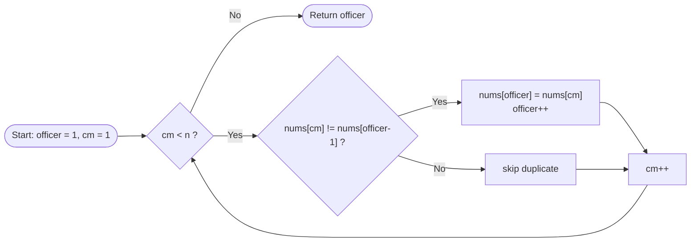

<div align="center">

# 🧹 Remove Duplicates from Sorted Array


-orange?style=for-the-badge)
-purple?style=for-the-badge)


*A clean, in-place, single-pass solution using the slow/fast two-pointer technique.*

</div>

---

## 📑 Table of Contents

- [Problem](#-problem)
- [Intuition](#-intuition)
- [Visual Walkthrough](#-visual-walkthrough)
- [Solution](#-solution)
- [Complexity](#-complexity-analysis)
- [Test Cases](#-test-cases)
- [Lessons Learned](#-lessons-learned)
- [Follow-up](#-follow-up)

---

## 📝 Problem

Given an integer array `nums` sorted in **non-decreasing order**, remove the duplicates **in-place** so that each unique element appears only once, keeping the relative order.

Return **`k`**, the number of unique elements. The first `k` elements of `nums` must hold the unique values; anything after that is ignored.

| Input | Output |
|:------|:-------|
| `[1,1,2]` | `2`, nums = `[1,2,_]` |
| `[0,0,1,1,1,2,2,3,3,4]` | `5`, nums = `[0,1,2,3,4,_,_,_,_,_]` |

<details>
<summary><b>📏 Constraints</b></summary>

- `1 <= nums.length <= 3 * 10^4`
- `-100 <= nums[i] <= 100`
- `nums` is sorted in non-decreasing order

</details>

---

## 💡 Intuition

> [!TIP]
> **Sorted array → duplicates are always neighbours.**
> So we never need a hash set. We only need to compare each element with the **last unique value we kept**.

Two pointers do all the work:

| Pointer | Role | Starts at |
|:--------|:-----|:---------:|
| ✍️ `officer` (slow) | Where the next unique value is **written** | `1` |
| 🔍 `cm` (fast) | **Reads** every element | `1` |

`nums[0]` is always unique, so both start at index `1`.



---

## 🎬 Visual Walkthrough

**Input:** `[0, 0, 1, 1, 1, 2, 2, 3, 3, 4]`

| Step | `cm` | `nums[cm]` | Last unique | Action | `officer` | Array (first `officer` items) |
|:---:|:---:|:---:|:---:|:---|:---:|:---|
| 1 | 1 | 0 | 0 | ⏭️ skip | 1 | `[0]` |
| 2 | 2 | 1 | 0 | ✅ write | 2 | `[0, 1]` |
| 3 | 3 | 1 | 1 | ⏭️ skip | 2 | `[0, 1]` |
| 4 | 4 | 1 | 1 | ⏭️ skip | 2 | `[0, 1]` |
| 5 | 5 | 2 | 1 | ✅ write | 3 | `[0, 1, 2]` |
| 6 | 6 | 2 | 2 | ⏭️ skip | 3 | `[0, 1, 2]` |
| 7 | 7 | 3 | 2 | ✅ write | 4 | `[0, 1, 2, 3]` |
| 8 | 8 | 3 | 3 | ⏭️ skip | 4 | `[0, 1, 2, 3]` |
| 9 | 9 | 4 | 3 | ✅ write | 5 | `[0, 1, 2, 3, 4]` |

🎯 **Result:** `k = 5`

---

## 🚀 Solution

```cpp
class Solution {
public:
    int removeDuplicates(vector<int>& nums) {
        if (nums.empty()) return 0;

        int officer = 1;   // ✍️ next position to place a unique value
        int cm = 1;        // 🔍 scans the array

        while (cm < nums.size()) {
            if (nums[cm] != nums[officer - 1]) {   // new unique value found
                nums[officer] = nums[cm];
                officer++;
            }
            cm++;          // always move forward
        }

        return officer;    // k = number of unique elements
    }
};
```

<details>
<summary><b>🔁 Alternative: <code>for</code> loop version</b></summary>

```cpp
class Solution {
public:
    int removeDuplicates(vector<int>& nums) {
        if (nums.empty()) return 0;

        int officer = 1;
        for (int cm = 1; cm < nums.size(); cm++) {
            if (nums[cm] != nums[officer - 1]) {
                nums[officer++] = nums[cm];
            }
        }
        return officer;
    }
};
```

</details>

---

## 📊 Complexity Analysis

| | Complexity | Reason |
|:--|:--:|:--|
| ⏱️ **Time** | **O(n)** | Every element is visited exactly once |
| 💾 **Space** | **O(1)** | Array modified in-place, no extra memory |

---

## 🧪 Test Cases

| # | Input | Expected `k` | First `k` elements | Result |
|:-:|:------|:-:|:--|:-:|
| 1 | `[1,1,2]` | 2 | `[1,2]` | ✅ |
| 2 | `[0,0,1,1,1,2,2,3,3,4]` | 5 | `[0,1,2,3,4]` | ✅ |
| 3 | `[1]` | 1 | `[1]` | ✅ |
| 4 | `[1,2]` | 2 | `[1,2]` | ✅ |
| 5 | `[-100,-100,100]` | 2 | `[-100,100]` | ✅ |

---

## 🧠 Lessons Learned

> [!IMPORTANT]
> Bugs I fixed from my first attempt. Each one is a classic off-by-one or return-value trap.

| ❌ Before | ⚠️ Problem | ✅ After |
|:--|:--|:--|
| `int officer = 0;` | Overwrites `nums[0]`, the first unique value | `int officer = 1;` |
| `cm < nums.size() - 1` | Skips the last element | `cm < nums.size()` |
| `nums[cm] == nums[cm - 1]` | `nums[cm-1]` may already be overwritten | `nums[cm] != nums[officer - 1]` |
| `return nums[i];` in a loop | Returns a **value**, not the **count** | `return officer;` |
| Unused `uniqueOrder` | Dead code | Removed |

> [!NOTE]
> **Habit I built from this:** always dry-run tiny edge cases like `[1,1,2]` and `[1,2]` before submitting.

---

## 🔭 Follow-up

**Remove Duplicates from Sorted Array II:** allow each value **at most twice**.

Same pattern, one small change: start both pointers at `2` and compare with `nums[officer - 2]`.

---

<div align="center">

### 🏷️ Pattern Tags

`Two Pointers` · `In-Place` · `Array` · `Sorted Input`

⭐ *Part of my DSA practice series. Star the repo if it helped!*

</div>
